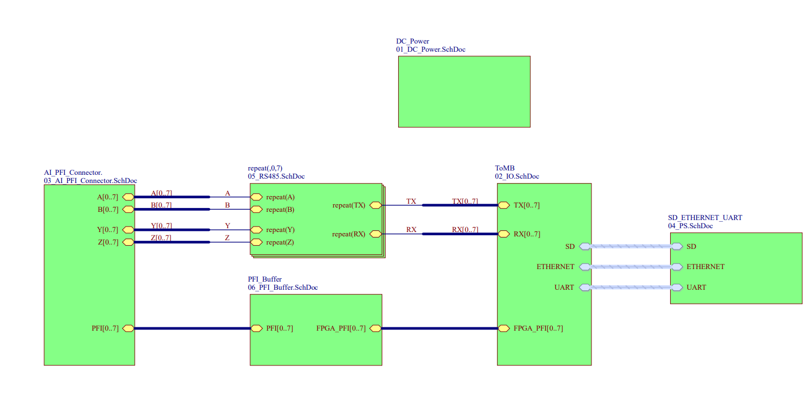
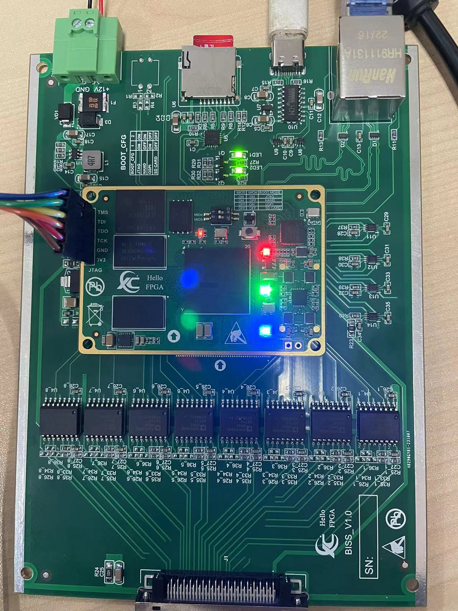

# BISS-C-Board
This is 8 channels BISS-C FPGA board design. BISS-C is one kind of full duplex RS485/422 serial interface. So this board can also used as RS485/422 application.

This board should used together with out ZYNQ7020 Core board.

You can find the core board with this repo https://github.com/Hello-FPGA/ZYNQ7020_Core_Board 

You can find the software design with this repo https://github.com/Hello-FPGA/BISS-C

## QA

If you want more information or other request. Contact us with info@hello-fpga.com or QQ 947559581